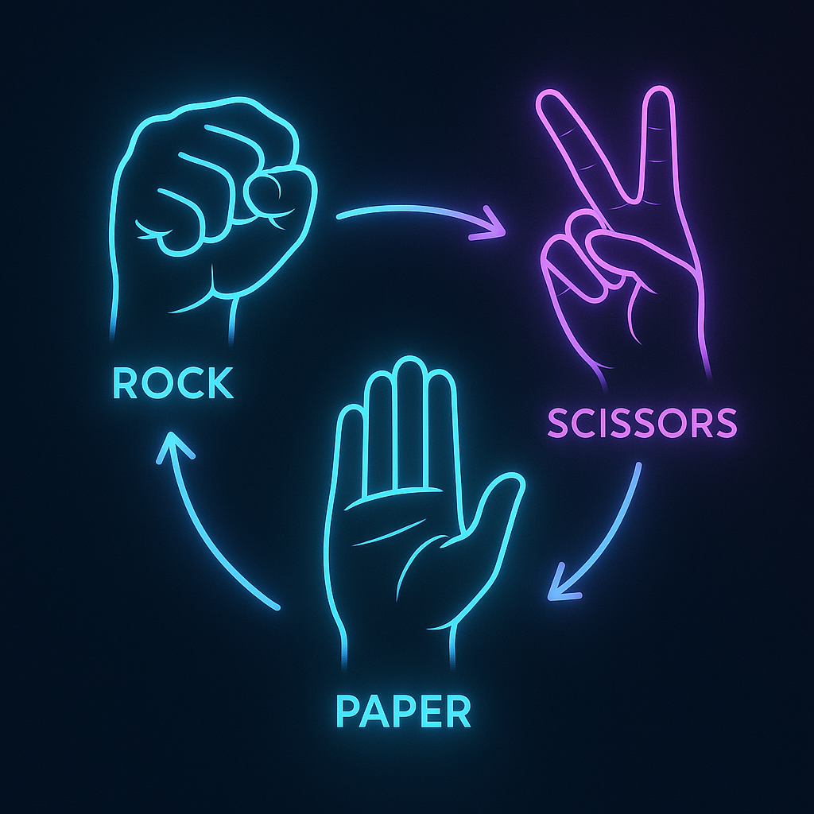

# ✊✋✌️ Rock-Paper-Scissors Image Classification Using CNN

## 📌 Project Overview  
This project classifies hand gestures into **Rock**, **Paper**, or **Scissors** categories using **Convolutional Neural Networks (CNNs)**.  

To better understand performance differences, we first implemented traditional **Machine Learning (ML)** and **Artificial Neural Network (ANN)** approaches. These methods were limited in generalization capability for unseen image data, as they rely heavily on manually extracted features.  

This served as a **baseline comparison** to highlight the superior performance of CNNs, which can automatically learn spatial hierarchies from raw images. CNNs outperformed ML and ANN models significantly in terms of accuracy and robustness.

---



---

## 🗂️ Dataset Overview  
We used an image dataset containing labeled hand gesture images:
- `rock/` – images of a closed fist  
- `paper/` – images of an open hand  
- `scissors/` – images of two extended fingers  

## 🗂️ Dataset Overview  
We used an image dataset containing labeled hand gesture images:
- `rock/` – images of a closed fist  
- `paper/` – images of an open hand  
- `scissors/` – images of two extended fingers  

> ⚠️ The dataset is not included in this repository due to size limits.  
> Please use your own or download a public Rock-Paper-Scissors image dataset and structure it as shown above.  
> 📩 *If you would like access to the dataset used in this project, feel free to contact me at [uqashazahid@gmail.com](mailto:uqashazahid@gmail.com).*

---

```plaintext
Dataset/
├── train/
│ ├── rock/
│ ├── paper/
│ └── scissors/
├── validation/
│ ├── rock/
│ ├── paper/
│ └── scissors/
└── test/
├── rock/
├── paper/
└── scissors/
```
---


---

## 📁 Files Overview

### 📂 CNN/  
The `CNN/` folder contains all files related to the Convolutional Neural Network implementation:
- **`cnn.ipynb`** – This Jupyter Notebook includes all code for:
  - Training the CNN model  
  - Performing real-time predictions  
  - Evaluating the model  
  - Visualizing performance  

- **Saved Keras model files** – Best-performing models are saved after training.  

- **Image Augmentation** – Various techniques (rotation, zoom, flip, etc.) were used to:
  - Expand dataset diversity  
  - Improve accuracy  
  - Reduce overfitting  

### 📂 Machine_Learning/  
The `Machine_Learning/` folder contains:
- **`ml.ipynb`** – A complete ML pipeline including:
  - Image preprocessing & path extraction  
  - Saving labels and paths to Excel  
  - Feature extraction  
  - Standardization  
  - Model training & evaluation  

---

## 🔬 Traditional ML Models  

We trained several ML models using extracted image features:
```python
models = {
    "Logistic Regression": LogisticRegression(multi_class='multinomial', solver='lbfgs', max_iter=1000),
    "SVM (RBF Kernel)": SVC(kernel='rbf'),
    "Random Forest": RandomForestClassifier(),
    "k-NN": KNeighborsClassifier(n_neighbors=5),
    "Decision Tree": DecisionTreeClassifier(),
}
```
## 📈 Model Evaluation Results

### ✅ Best Machine Learning Model: SVM (RBF Kernel)
          precision    recall  f1-score   support
       0     0.9802    0.9914    0.9858       349
       1     0.9970    0.9880    0.9925       333
       2     0.9884    0.9855    0.9870       346

accuracy                         0.9883      1028


### 🤖 Artificial Neural Network (ANN) Results

129/129 ━━━━━━━━━━━━━━━━━━━━ 1s 7ms/step
accuracy: 1.0000
loss: 9.6035e-04


> 📌 Although ANN achieved perfect training accuracy, this indicates possible overfitting, highlighting why CNNs are more suitable for image-based tasks.


```
## 🧠 Why CNN?

CNNs were ultimately preferred because:

- 🚫 No need for manual feature extraction  
- 📈 Better performance on unseen image data  
- 🧭 Automatically learn spatial hierarchies from raw pixels  
- 💪 More scalable and robust for real-world applications  

---

## 📊 CNN Final Results

After applying data augmentation and tuning:

- ✅ **Training Accuracy**: 99.98%  
- ✅ **Validation Accuracy**: 100%  

---

## 🛠️ Requirements

> ⚠️ **Note:** Please use **Python 3.9 to 3.12**.  
> TensorFlow is **not supported** in Python versions above 3.12.

- Python 3.9–3.12  
- TensorFlow / Keras  
- NumPy  
- Pandas  
- Matplotlib
- Seaborn
- OpenCV (optional)


